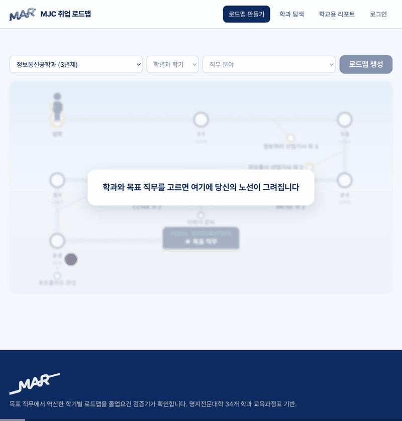
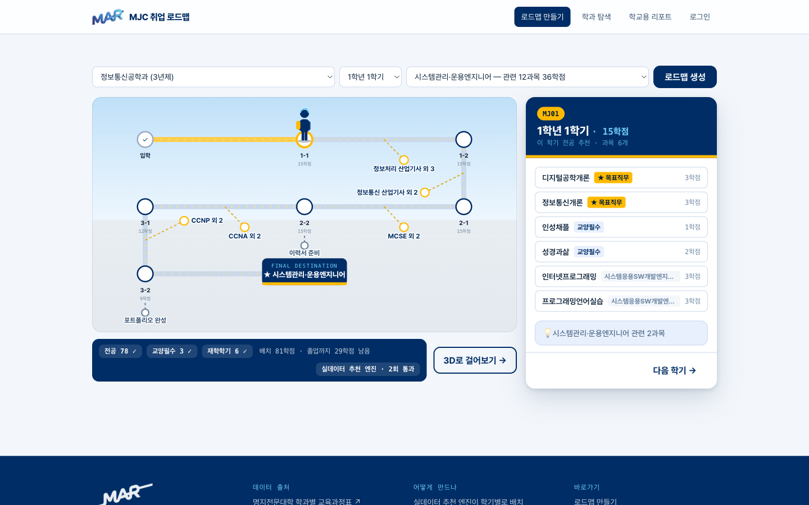
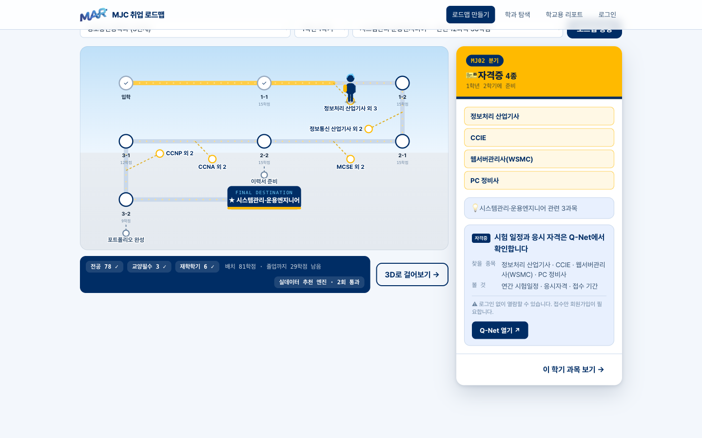
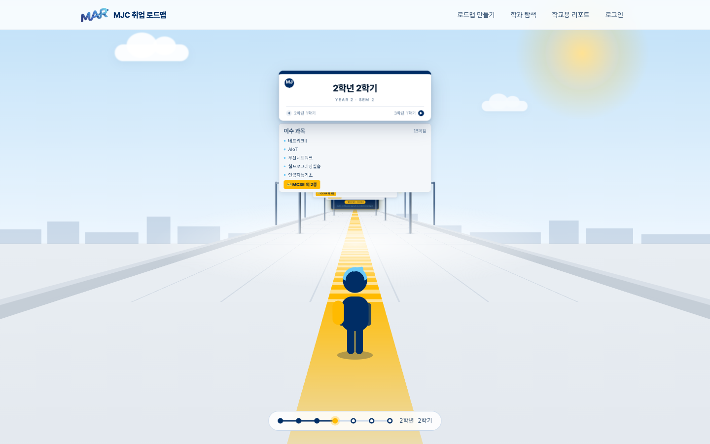
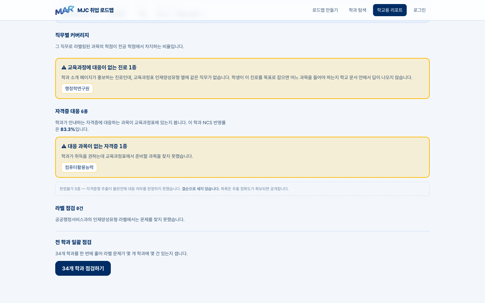
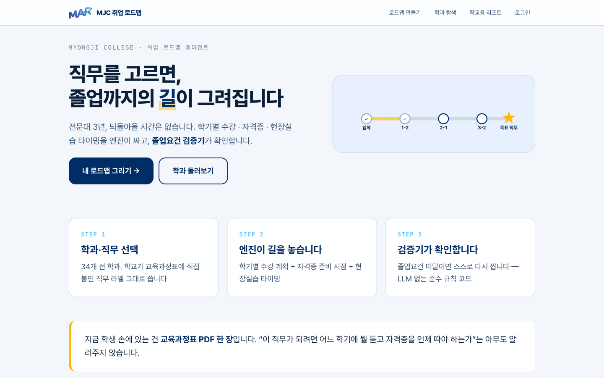
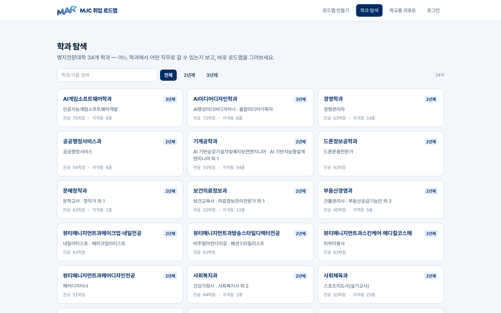

# MJC 취업 로드맵 에이전트

> 원하는 직무를 고르면 **졸업이 보장되는** 학기별 로드맵(수강 · 자격증 · 현장실습)을 짜주는 전문대 특화 AI 에이전트.
> 학교에는 교육과정 진단 리포트를 제공한다.

<!-- TODO(제출 전): 데모 GIF를 여기, 글보다 먼저 -->

2026학년도 명지전문대학 AI 해커톤 · 팀 3인 · [설계서](docs/DESIGN.md) · [AI 활용 기록](docs/AI_USAGE.md)

---

## 주요 화면



| | |
|---|---|
|  |  |
| **로드맵 스튜디오** — 생성된 노선 위를 캐릭터가 걷는다. 검증 배지(`전공 78/66 ✓ …`)와 엔진 태그가 항상 붙는다 | **자격증 분기** — 분기 동그라미를 누르면 캐릭터가 걸어가 도착한 뒤 자격증 패널(Q-Net 안내 포함)이 열린다 |
|  |  |
| **3D 걷기** — 같은 로드맵을 복도로 걷는다. 행선판을 누르면 그 학기의 추천 이유가 열린다 | **트랙 B 리포트** — 직무 커버리지 · 대응 없는 진로 · 자격증 결손 · 라벨 품질. 판정불가는 결손으로 세지 않는다 |
|  |  |
| **랜딩** — 문제 한 줄과 트랙 프리뷰, CTA 두 개 | **학과 탐색** — 34개 학과 카드 · 검색·학제 필터 · 상세에서 바로 로드맵 생성 |

## 문제

전문대는 2~3년 안에 졸업요건 · 자격증 · 현장실습 · 취업을 **동시에** 끝내야 한다. 4년제와 달리 복구할 시간이 없다 — 1학년에 선수과목이나 자격증 타이밍을 한 번 놓치면 만회가 어렵다.

그런데 학생이 손에 쥐는 건 교육과정표 PDF 한 장이다. *"시스템관리·운용엔지니어가 되려면 어느 학기에 뭘 듣고 CCNA를 언제 따야 하는가"* 는 아무도 알려주지 않는다.

**수강신청 전날 밤의 김민준(가명, 정보통신공학과 2학년).** 막연히 "서버나 네트워크 쪽"이 좋다고 생각하지만 직무명으로 말하지는 못한다. 화면의 교육과정표에는 과목 수십 개가 학년·학기 순으로 나열돼 있을 뿐 — 어떤 과목이 그 길로 이어지는지, 네트워크관리사는 언제 따야 하는지, 이력서는 언제부터 준비해야 하는지는 어디에도 없다. 남은 학기는 네 번. 이번 신청을 틀리면 되돌릴 시간이 없다.

이 서비스에서 김민준은 학과를 고르고 직무 칸을 **비워둔 채** 생성을 누른다. 학과 데이터에서 배정 학점이 가장 많은 직무가 추천되고, 학기별 트랙 위에 "운영체제·네트워크Ⅰ 이수 후 네트워크관리사 준비" 같은 시점 조언이 얹힌 로드맵이 즉시 그려진다 — 그리고 하단에 **졸업요건 충족 ✓**. 3분 전엔 없던 답이다.

**지금은 어떻게 버티고 있나.** 학교의 SMART CARE 시스템에도 "로드맵" 메뉴가 있다. 다만 그건 **학생이 직접 입력해 등록하는** 이력 관리 양식이다. 문제는 학생이 그 빈칸에 뭘 넣어야 할지 모른다는 것이다.

> **SMART CARE는 로드맵을 등록하는 곳이고, 우리는 로드맵을 만들어주는 엔진이다.**
> 우리 출력물이 그 시스템의 입력물이 된다 — 대체가 아니라 상류 공정이다.

## 해결

**생성기가 무엇이든, 1차 출력은 믿지 않는다.** 그래서 생성기 위에 졸업요건 검증기를 얹고 되먹임 루프를 돌린다.

```
목표 직무 입력 (미정이면 학과 데이터의 직무 라벨 학점 순위로 추천)
   ↓
추천 엔진 (실데이터 기반 결정론 규칙)  ──생성──▶  학기별 수강 · 자격증 · 현장실습 계획
   ↓                                                  ↓
   └ LLM 비교 모드 (MJC_ENGINE=llm, 같은 계약으로 주입)   졸업요건 검증기 (순수 규칙 코드)
                                                      ↓
                              충족? ──아니오──▶ 미달 사유(fix)를 붙여 재생성 (최대 3회)
                                                      ↓ 예
                                              "졸업요건 충족 ✓"
```

메인 엔진은 **실데이터 기반 결정론 추천**이다. 학교가 교육과정표에 부여한 과목↔직무 라벨로 역산하므로 "왜 이 과목이냐"에 데이터로 답할 수 있고, 응답이 즉시(0.03초)이며, 같은 입력에 언제나 같은 결과가 재현된다. LLM 에이전트도 같은 계약으로 만들어 비교 검증했고(응답의 `engine` 필드가 어느 쪽이 짰는지 밝힌다), **근거 투명성과 재현성**을 이유로 규칙 엔진을 메인에 놓았다.

검증기는 LLM을 쓰지 않는다. 3년제(전공 66 · 교양필수 3 · 6학기) / 2년제(전공 45 · 교양필수 3 · 4학기)를 결정론적으로 검사하고, 미달 항목마다 `{rule, label, required, actual, shortfall, fix}`를 낸다. 이 `fix` 문구가 그대로 재생성 프롬프트가 되고, 동시에 화면에 표시된다.

**판정할 수 있는 것만 판정한다.** 총 졸업학점(110/75)은 미달로 잡지 않는다 — 교육과정표가 전공 전용 문서라 교양선택·일반선택 과목이 데이터에 아예 없기 때문이다. 없는 과목을 가짜 블록으로 채우면 거짓말이 되고, 미달로 잡으면 어떤 로드맵도 통과하지 못한다. 실제로 초안 룰로 34개 학과를 돌렸을 때 **32개가 졸업 불가**로 나왔다. 대신 "졸업까지 29학점 남음"을 정보로 알린다.

이미 이수한 학기·학점을 함께 계산하므로 2·3학년 재학생도 남은 학기만으로 로드맵을 받는다. 검증기 테스트 18개로 2년제/3년제 규칙과 이수분 합산을 검증한다.

### 주요 화면

| 화면 | 설명 |
|---|---|
| 랜딩 | 서비스 소개 + 시작하기 |
| 로드맵 스튜디오 | **2D 트랙(기찻길)** — 상단 컨트롤 바에서 학과·학년/학기·이수 과목·목표 직무(**미정 가능**, 데이터 기반 추천) 입력. 학기가 역, 자격증·이력서가 분기, 캐릭터가 트랙을 걸어 이동, 종착역에서 "졸업요건 충족 ✓" 배지 |
| 3D 걷기 모드 | 생성한 로드맵을 1인칭으로 걸어보는 연출 (스튜디오에서 진입) |
| 학과 탐색 / 상세 | 34개 학과 카드 → 커리큘럼·자격증·진로 → "이 학과로 내 로드맵 그리기" |
| 리포트 | 학교용 — 직무 커버리지 · 자격증 결손 진단 |
| 로그인·회원가입 | 학번 기반, 이메일 인증번호 가입 (게스트 모드 지원 — 로그인 없이 전 기능 데모 가능) |

## 데이터 — 명지전문대 전 학과

학과별 파서를 만들지 않았다. **파이프라인 하나에 전 학과를 통과시켰다.**

| 항목 | 결과 |
|---|---|
| 학과 | **34 / 35** (자유전공학과 제외 — 전공 미정 학과, 과목 2개뿐) |
| 과목 | **842개** |
| 처리 경로 | **코드 파싱 100% · LLM 폴백 0회** |
| 직무 라벨 | **34개 학과** 전 과목 보유 |
| 자격증 | 26개 학과 |

```
게시판(menu_idx=2207) 순회 → PDF 35개 수집
   ↓
pdfplumber 표 추출 → 헤더 기반 파싱 → 스키마 검증
                          └(헤더 못 찾으면)→ LLM 구조화 → 재시도
   ↓
data/depts/*.json  (+ _report.json 품질 지표)
```

**과목 식별자는 코드가 결정론적으로 조립한다.** 원본 과목명에 `Ⅰ`(U+2160) · `I`(라틴) · `1`이 섞여 있어, 문자열로 주고받으면 체크박스 하나가 어긋나 "미이수"로 오판된다. 정규화 슬러그로 수렴시켰다 — 전 학과 776과목 충돌 0건.

## 데이터 아키텍처

저장소를 **두 층으로 분리했다.** 과목 데이터는 DB에 넣지 않는다.

```
┌─ 교육과정 데이터 (읽기 전용) ────────────────────────────┐
│  data/depts/*.json      34개 학과 · 842과목 · 직무 라벨   │
│  파이프라인이 생성하고 서버는 읽기만 한다                  │
│  catalog.py 가 유일한 창구 — 로드 시점에 경계 검증         │
└──────────────────────────────────────────────────────────┘
┌─ 유저 데이터 (CRUD) ─────────────────────────────────────┐
│  PostgreSQL 16 · SQLAlchemy 2.0 + psycopg                │
│  users · completed_courses · saved_roadmaps               │
└──────────────────────────────────────────────────────────┘
```

**왜 나눴나.** 과목 데이터를 DB에 넣으면 DB가 죽을 때 코어(게스트 → 입력 → 로드맵)까지 죽는다. 지금은 **DB가 없어도 서버가 뜨고** 로그인 계열만 503으로 떨어진다. 게스트 모드가 필수 경로라 이렇게 해야 한다.

### 테이블

| 테이블 | 컬럼 | 비고 |
|---|---|---|
| `users` | `id` · `student_id`(unique) · `name` · `email`(unique) · `dept_id` · `password_hash` · `created_at` · `email_verified_at` · `verification_token` · `verification_expires_at` · `exchange_code` · `exchange_expires_at` | 비밀번호는 bcrypt 해시. 인증·교환 토큰에 만료시각 동반 |
| `completed_courses` | `id` · `user_id`(FK) · `course_id` · `year` · `semester` | **`course_id`로 저장한다.** 과목명으로 저장하면 `Ⅰ/I/1` 표기 혼재로 매칭이 깨진다 |
| `saved_roadmaps` | `id` · `user_id`(FK) · `target_job` · `roadmap_json` · `created_at` | 직무별 1개 — 같은 직무로 다시 저장하면 덮어쓴다 |

`completed_courses` · `saved_roadmaps`는 `users`에 `cascade="all, delete-orphan"`으로 묶여 있다.

### CRUD 대응

| | 대상 | 엔드포인트 | 동작 |
|---|---|---|---|
| **C**reate | `users` | `POST /auth/signup` → 201 | 가입. 인증번호 티켓(`/auth/email/code`→`verify`)과 함께면 즉시 토큰 발급, 없으면 인증 링크를 눌러야 로그인된다 |
| | `saved_roadmaps` | `POST /me/roadmaps` → 201 | 로드맵 저장 |
| | `completed_courses` | `PUT /me/courses` | 이수 과목 행 삽입 |
| **R**ead | 세 테이블 전부 | `GET /me` | 내 정보 + 이수 과목 + 저장 로드맵 |
| **U**pdate | `users` | `GET /auth/verify` · `POST /auth/exchange` · `POST /auth/resend` | 인증 완료 표시, 1회용 교환 코드 발급·소진, 재발송 |
| | `saved_roadmaps` | `POST /me/roadmaps` | **같은 `target_job`이면 덮어쓴다** — 시연 중 여러 번 눌러도 목록이 쌓이지 않게 |
| | `completed_courses` | `PUT /me/courses` | 전체 교체 (아래 Delete 참조) |
| **D**elete | `completed_courses` | `PUT /me/courses` | **교체 의미로 구현.** 기존 행을 지우고 받은 목록으로 다시 채운다 |
| | 자식 행 전체 | ORM cascade | `users` 삭제 시 `delete-orphan`으로 함께 삭제 |

> ⚠️ **독립 `DELETE` 엔드포인트는 만들지 않았다.** 회원 탈퇴·개별 과목 삭제는 데모 시나리오에 등장하지 않는다. 삭제 자체는 `PUT /me/courses`의 교체 동작과 ORM cascade로 이미 일어난다. 서비스로 운영하려면 `DELETE /me`(탈퇴)를 추가해야 한다.

### 마이그레이션

앱 시작 시 `Base.metadata.create_all()`을 쓴다. Alembic을 넣지 않았다 — 스키마가 3개 테이블로 고정되고 해커톤 기간에 변경이 없었다. **스키마를 바꾸면 볼륨을 지워야 한다** (`docker compose down -v`).

### 무결성

| 장치 | 어디서 |
|---|---|
| `student_id` · `email` 유일성 | DB unique 제약 + 가입 시 409 `ALREADY_REGISTERED` |
| 중복 `course_id` 제거 | `catalog.resolve`와 `validator` **양쪽에서** — 중복을 흘리면 학점이 두 번 세어져 졸업요건이 뚫린다 |
| 타임존 | 전 컬럼 `DateTime(timezone=True)`. SQLite는 naive를 주므로 비교 전에 UTC로 되돌린다 |
| 교환 코드 | 60초 · **1회용**. JWT를 리다이렉트 URL에 싣지 않기 위한 것 |

## 트랙 B — 학교용 진단 리포트

같은 데이터를 학교 쪽에서 본다. 외부 데이터 없이 **학교 자체 데이터 간 정합성**만으로 성립한다.

| 진단 | 무엇을 드러내나 |
|---|---|
| 직무별 커버리지 | 한쪽에 쏠렸으면 다른 직무 지망생은 들을 과목이 없다 |
| 준비 시점 | 직무 과목이 3학년에만 몰리면 자격증을 앞당길 수 없다 |
| 자격증 결손 | 학과가 내건 자격증에 대응 과목이 없으면 그건 학생 개인 몫이다 |

**실제로 찾은 결손** (원본 대조 완료):

| 학과 | 내건 자격증 | 대응 교과목 |
|---|---|---|
| 항공서비스과 | 컴퓨터활용능력 | 없음 |
| 경영학과 | 전자상거래관리사 | 없음 |
| 지적공간정보학과 | 정보처리(산업)기사 | 없음 |

자격증 판정은 **대응 있음 / 대응 없음 / 판정 불가** 3분류다. 키워드 사전이 IT·공학 위주라 디자인·어학 자격증은 애초에 판정할 수 없는데, 이를 "결손"으로 세면 없는 문제를 지어내게 된다. 리포트에 판정 불가를 그대로 표기한다.

**졸업요건 결손도 하나 찾았다.** 드론정보공학과는 2026학년도 교육과정표의 전공 15과목을 **전부 이수해도 43학점** — 학교 공통 졸업요건(2년제 전공 45학점)에 2학점 모자란다. 원본 PDF를 학기별로 재집계해 확정했다(11+11+12+9=43). 검증기 274개 시나리오 전수 검사에서 남는 미달 2건이 정확히 이 학과다 — 엔진의 실패가 아니라 **어떤 로드맵으로도 통과할 수 없는 입력**이고, 이런 불일치를 찾아내는 것이 트랙 B의 존재 이유다.

## 시스템 아키텍처

```
                    [브라우저 — React SPA (web/dist)]
                         │  fetch — lib/api.js 단일 창구, 과목은 course_id로만
                         ▼
┌───────────────────── FastAPI (server/) ─────────────────────┐
│                                                             │
│  GET  /depts · /report/{id} ──────▶ data/depts/*.json       │
│                                     (읽기 전용 시드)          │
│  POST /roadmap ──▶ 추천 엔진(결정론 규칙) ⇄ 졸업요건 검증기    │
│                    └ MJC_ENGINE=llm 시 Claude 비교 모드       │
│                                                             │
│  /auth/* · /me/* ─────────────────▶ PostgreSQL              │
│  (JWT 액세스+리프레시, 이메일 인증)     (유저 데이터 전용)       │
│                                                             │
│  StaticFiles ◀── web/dist (빌드 산출물, /app/* SPA 폴백)      │
└─────────────────────────────────────────────────────────────┘
                         ▲
        [pipeline/] 수집·추출 — mjc.ac.kr 게시판·학과 페이지
        PDF 35개 → 파싱 → 검증 → data/*.json  (쓰기는 파이프라인만)
```

**저장소가 둘로 나뉜 것이 의도다.** 학사 데이터(과목·직무·자격증)는 파이프라인이 생성하는 읽기 전용 JSON — 원천이 학교 문서라 서비스에서 수정될 일이 없고, DB 없이도 코어가 돈다. DB는 서비스가 만들어내는 유저 데이터만 담는다.

### 데이터별 CRUD

| 데이터 (저장소) | Create | Read | Update | Delete |
|---|---|---|---|---|
| 회원 `users` (PostgreSQL) | `POST /auth/signup` — 이메일 인증번호(`/auth/email/code`→`verify`) 후 가입 | `GET /me` | — | — |
| 이수 내역 `completed_courses` (PostgreSQL) | `PUT /me/courses` | `GET /me` | `PUT /me/courses` (전체 교체) | 같은 PUT에서 체크 해제 = 삭제 |
| 저장 로드맵 `saved_roadmaps` (PostgreSQL) | `POST /me/roadmaps` | `GET /me` | — | — |
| 세션 (JWT) | `POST /auth/login` | — | `POST /auth/refresh` (토큰 갱신) | 클라이언트 토큰 폐기 |
| 학과·과목·자격증 (`data/*.json`) | 파이프라인만 | `GET /depts` · `GET /report/{id}` | 파이프라인 재실행 | — |
| 로드맵 생성 결과 | `POST /roadmap` (비저장 — 게스트 경로) | 응답 즉시 | 재생성 = 새 Create | 저장 안 하면 소멸 |

회원 수정·탈퇴, 로드맵 삭제는 **의도적으로 범위 밖**이다 — 데모에 보이지 않는 기능은 만들지 않는다는 팀 원칙(CLAUDE.md)에 따라, 해커톤 범위에서 실제 흐름(가입→인증→이수 관리→로드맵 저장)에 필요한 연산만 구현했다.

## 실행 방법

```bash
git clone https://github.com/bongjunpyo/hackathon_mjc.git
cd hackathon_mjc
```

**서버** (검증기 테스트)

```bash
cd server
uv sync
uv run pytest          # 165개 테스트 (검증기 · 엔진 · 카탈로그 · 인증 · 트랙 B)
uv run fastapi dev main.py   # API + 프론트 빌드 정적 서빙 (web/dist가 있으면)
# 이메일 인증은 SMTP 없이 동작한다 — 인증번호가 서버 콘솔에 찍힌다 (server/EMAIL.md)
```

**프론트**

```bash
cd web
npm install
npm run dev            # 개발 서버
npm run build          # 빌드 → 서버가 정적 서빙
```

**데이터 파이프라인** (재현용 — 산출물은 `data/`에 커밋되어 있다)

```bash
cd pipeline
uv sync
uv run python collect.py              # 전 학과 교육과정표 PDF 수집
uv run python collect_dept_info.py    # 자격증 · 진로 · 인재양성유형
uv run python extract_all.py          # PDF → data/depts/*.json
uv run python build_report.py         # 트랙 B 진단 → data/reports/*.json
```

> **재현 확인 (2026-08-07):** 새 폴더에 clone → `uv sync` → 테스트 전부 통과 → `npm install && npm run build` → API 스모크(34개 학과·로드맵 생성·리포트) 전부 통과. **API 키 없이도 코어가 동작한다** — 메인 엔진이 규칙 기반이라서다.

## 기술 스택

| 구분 | 사용 기술 | 선택 이유 |
|---|---|---|
| 프론트 | React + Vite + Tailwind | 화면 7종. 빌드 산출물을 서버가 정적 서빙해 실행 1커맨드 유지 |
| 백엔드 | FastAPI (uv) + PostgreSQL | DB는 유저 데이터 전용 — 과목 데이터는 JSON 시드 |
| 파이프라인 | pdfplumber + Pydantic | 표 추출 후 스키마 검증. LLM은 폴백 |
| 추천 엔진 | 실데이터 기반 결정론 규칙 (메인) | 근거가 데이터에 있고, 즉시 응답·재현 가능 |
| LLM | 비교 검증용 보조 (`MJC_ENGINE=llm` 옵트인) | 같은 계약으로 주입해 비교 — 검증기는 **LLM을 쓰지 않는다** |

## AI 코딩 에이전트 활용

위임한 작업과 검증 과정은 [`docs/AI_USAGE.md`](docs/AI_USAGE.md)에, 전체 활용 구성은 [개발 보고서](docs/REPORT.md) §3에 기록했다.

**개발 전 과정을 Claude Code(CLI) 페어 프로그래밍으로 진행했다** — 20시간 단일 장기 세션(컨텍스트 요약 지속)으로 기획→설계→구현→검증→문서까지.

세 사람이 각자 Claude Code 세션을 돌렸고, 폴더 소유권이 그대로 에이전트 경계였다. 아래는 세 세션 합산 구성이다 (파트별 상세: [P2](docs/REPORT_P2_server.md) · [P3](docs/REPORT_P3_web.md)).

| 구성 | 사용 | 용도 |
|---|---|---|
| 모델 | Claude **Opus 5** · **Fable 5** (세션 — `/model`로 구간별 전환) / **Sonnet 5** (제품 내 LLM 비교 모드) | 설계·디버깅은 Opus, 빠른 반복은 Fable / 로드맵 에이전트 |
| 모드 | 플랜 모드(분석·계획) · 대화형 페어 프로그래밍(구현) | 수상작 분석·설계 / 코딩 전 과정 |
| 스킬 | `brainstorming` · `claude-api` · `artifact-design` · `notebooklm` · `make-interfaces-feel-better` | 주제 선정 / `agent.py` / 화면 프로토타입 / 수상작 43소스 분석 / UI 디테일 점검 |
| 플러그인 | `superpowers` | 스킬 우선 실행 규율 |
| MCP | `claude-in-chrome` · `playwright` | 화면 검증 전부(스크린샷 대조·픽셀 실측·상태 시퀀스) / 3D 잘림 해상도별 실측 |
| 도구 | WebFetch·WebSearch | **할루시네이션 방지** — 졸업요건·NCS·자격증·선행 서비스를 원문 확인, 출처와 함께 `data/enrichment/`에 저장 |
| 통제 | 폴더 소유권 + PR 리뷰 · main 직push 금지 | AI 산출물도 담당자 리뷰를 거쳐야 main에 들어간다 |

**위임 범위를 측정으로 정했다.** 처음에는 교육과정표 추출도 LLM에 맡길 계획이었다. 그런데 35개 학과 PDF의 헤더를 전수 확인하니 필수 5개 열의 이름이 전부 같았다 — 코드로 읽으면 되는 일이었다. 추출을 코드로 옮기고 LLM은 헤더가 깨진 파일의 폴백으로 남겼다. **폴백 발동 0회**, LLM 예산은 판단이 필요한 로드맵 에이전트에 집중시켰다.

검증 과정에서 잡은 오류 6건을 `AI_USAGE.md`에 실패 사례로 남겼다. 전부 **"초록불을 봤다"가 아무것도 증명하지 못한** 경우다 — 단위 테스트는 통과했고, 변이 검사라는 2차 장치를 붙였는데 그 2차 장치마저 세 번 거짓말을 했다.

실제로 효과가 있었던 것은 **"결과를 눈으로 찍어보기"** 였다. 34개 학과에 일괄 실행하고 나서야 32개가 구조적으로 졸업 불가능이라는 것을 알았고, 직무를 바꿔가며 출력해보고 나서야 세 직무의 로드맵이 전부 같다는 것을 알았다.

### 정량 지표

| | |
|---|---|
| 테스트 | 165개 |
| 변이 검사 | 10종, 전부 검출 |
| 파이프라인 | 34개 학과 · 842과목 · **코드 파싱 100% · LLM 폴백 0회** |
| `course_id` 충돌 | 776과목 **0건** |
| 실데이터 로드맵 | 34개 학과 중 **33개 통과** |
| **검증기 효과** | **274개 시나리오, 1차 15.0% → 루프 후 99.3%** |
| 트랙 B | 34개 학과 라벨 진단 18건 검출 |

마지막 줄이 이 프로젝트의 핵심 주장이다. **1차 생성만으로는 15.0%만 졸업요건을 충족한다. 검증기 되먹임 루프를 붙이면 99.3%가 된다.** 결정론 엔진이라 이 숫자는 언제든 같은 값으로 재현된다 — `cd server && uv run python metrics.py` 한 줄이면 몇 초 만에 확인할 수 있다. 루프 후에도 남는 미달 2건은 엔진의 실패가 아니라 **시스템이 찾아낸 학교 데이터의 실제 결손**이다(아래 트랙 B).

## 팀

| 이름 | 역할 | 담당 |
|---|---|---|
| 박효민 | P1 · 기획 · 발표 | 수집 · 추출 파이프라인, 트랙 B 산출, 문서, 발표 |
| 이동제 | P2 | 졸업요건 검증기 · 로드맵 에이전트 · 인증 · DB (`server/`) |
| 봉준표 | P3 | 화면 7종 (`web/`) |

## 다음 단계

이틀 안에 넣지 않기로 **판단한** 것들이다.

- **NCS 직무기술서 원문 대조** — 지금은 학교가 부여한 직무 라벨을 축으로 쓴다. 학과 소개 페이지에 학교의 NCS 매핑(`응용소프트웨어 엔지니어링` 등)이 있어 연결 고리는 확보돼 있다.
- **실제 채용공고 크롤링** — "교육과정이 채용시장과 어긋나는 지점"까지 보려면 필요하다. 20시간 예산에서는 수집·정제 리스크가 커 제외했다.
- **자격증↔과목 매칭을 키워드에서 의미 매칭으로** — 현재 IT·공학 34개 자격증만 판정 가능하다. 판정 불가를 숨기지 않고 드러내는 쪽을 택했다.
- **전 학과 Tier 1 품질 검증** — 원본 대조는 정보통신공학과만 했다. 나머지는 자동 통과분이라 품질 지표(`data/depts/_report.json`)로 정직하게 공개한다.

---

<sub>설계: [docs/DESIGN.md](docs/DESIGN.md) · 회의록: [docs/MINUTES_2026-08-06_kickoff.md](docs/MINUTES_2026-08-06_kickoff.md) · 운영 플레이북: [docs/PLAYBOOK.md](docs/PLAYBOOK.md)</sub>
